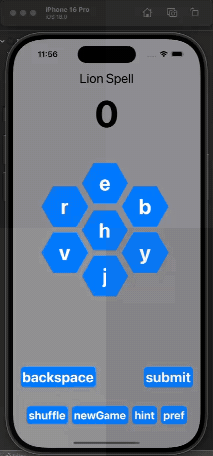
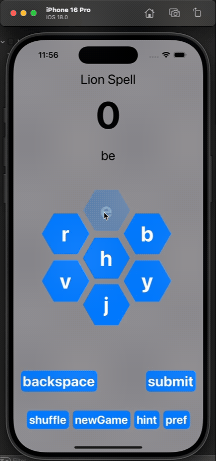
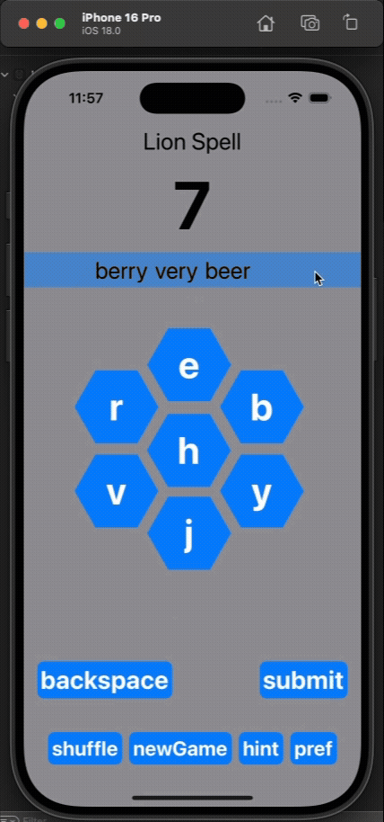

# 🦁 LionSpell

**LionSpell** is a SwiftUI-based word puzzle game inspired by the Spelling Bee challenge. The app supports English and French words and allows users to form as many valid words as possible from a given set of random letters. It tracks the score, shows hints, and offers preferences like letter count and language.

---

## ✨ Features

-   📚 Supports English and French word dictionaries
-   🔠 Select 5, 6, or 7 random letters to start a game
-   🔄 Shuffle letters and restart games easily
-   🧠 Hints view with total possible words, pangrams, and scoring details
-   ⚙️ Preferences menu to adjust language and letter count
-   🔤 Pangram detection and advanced word scoring logic
-   📱 Responsive SwiftUI interface with custom hexagon, pentagon, and square letter buttons

---

## 🧩 Concepts Practiced

-   State management using `@State`, `@Environment`, and `@Bindable` in SwiftUI
-   MVVM pattern for game logic and UI separation
-   Custom SwiftUI shapes (Hexagon, Pentagon, Square) using `Shape` protocol
-   Dynamic layout calculations for letter button positioning
-   File modularization and reusable components (Views, Models, GameManager)
-   Real-time form updates with interactive preferences and hint sections
-   Localization support through dictionary selection
-   Algorithmic logic for scoring, pangram detection, and filtering valid words

---

## 📂 Project Structure

-   `GameManager.swift`: Main logic for gameplay and data binding
-   `AppView.swift`: Main container view with interactive components
-   `LetterButtonsView.swift`: Dynamically displays letter buttons in custom shapes
-   `HintsView.swift`: Displays game summary including pangrams and scoring breakdown
-   `PreferencesView.swift`: Language and letter count picker with live game refresh
-   `Shape.swift`: Custom UI components for letter tiles (Hexagon, Pentagon, Square)
-   `Words.swift`: Word dictionaries for both languages
-   `GameData.swift`: Contains core game state and user preferences

---

## 📸 Demonstration

**🧠 Hints View and Submissions**  

**📜 Scrolling Captured Words**  

**⚙️ New Game, Shuffle, Preferences**  

---

## 🧠 Let’s Connect!

**Tej Jaideep Patel**  
B.S. Computer Engineering  
📍 Penn State University  
✉️ tejpatelce@gmail.com  
📞 814-826-5544

---
